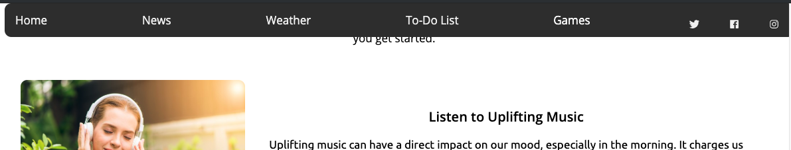
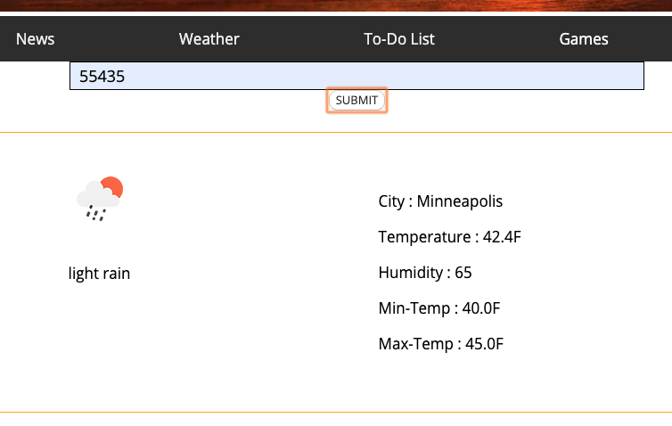
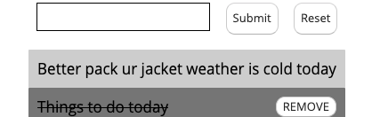
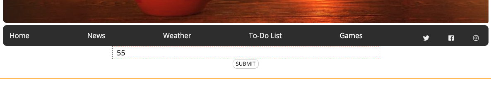
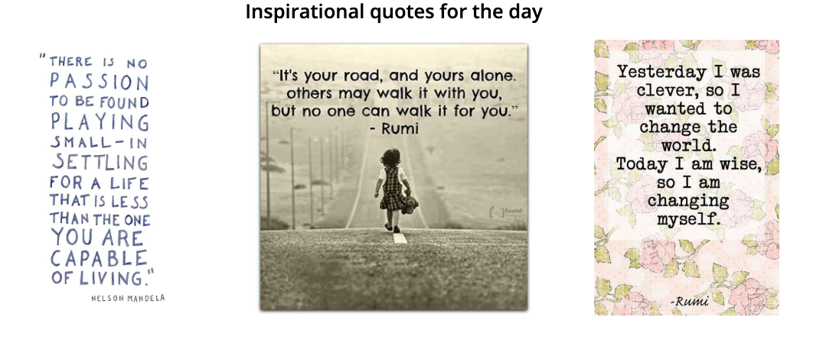
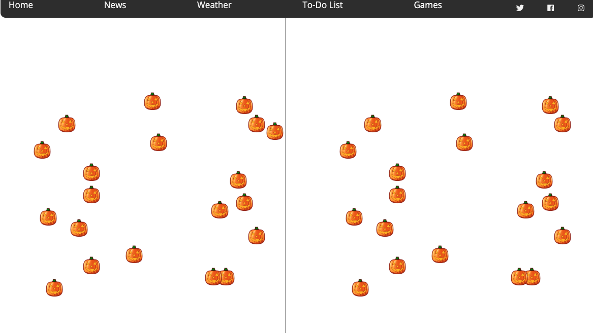

# Morning Rituals
This site is aimed to show all that u need for a morning. "Morning Rituals" page has News, weather, to-do list, some social media links. The news displays as a image carousel. There will be a fun game for commuting too.

Link to the webpage: [https://punitha86.github.io/Morning%20rituals/](https://punitha86.github.io/Morning%20rituals/)

## Technologies used:
  HTML
  CSS
  JavaScript
  jQuery

## Features added:
* Sticky navigation with a dropdown menu for Games

* Pulling data from the weather api based on Zipcode and storing it in the local storage. API used:![weather API] (https://openweathermap.org/api)

* Getting data from the news api and rendering it as a image carousel that autoplays till we click on a news to read it.API used:![News] (https://newsapi.org/)

* Adding a todo Item automatically if the weather is cold with a locally stored zipcode variable and some todo items in local storage

* Input validation in zipcode text field with basic css

* Random images in home page to generate inspirational quotes

* Spot the difference game.

## Challenges faced:
* Designing the spot the difference game. Locking upon the strategy took some time.
* Positioning the smileys in the absolute position was hard.
* Adding the locally stored variable
* Styling images with the theme took lotsa reading
* While appending components in a particular order in a loop it wasn't giving the structure needed.

## Learnings:
* Order of things matters at every stage from planning to implementation.
* Dom manipulation is amazing
* various CSS scaling and features.

## Improvements possible:
1. Local storage in the todo list item is not functioning well.
2. UI design can be better and more responsive.
3. Instead of an alert could have used modal for game reactions.
4. Adding Stock Market trend, local traffic info, favourite music channnel plugin
